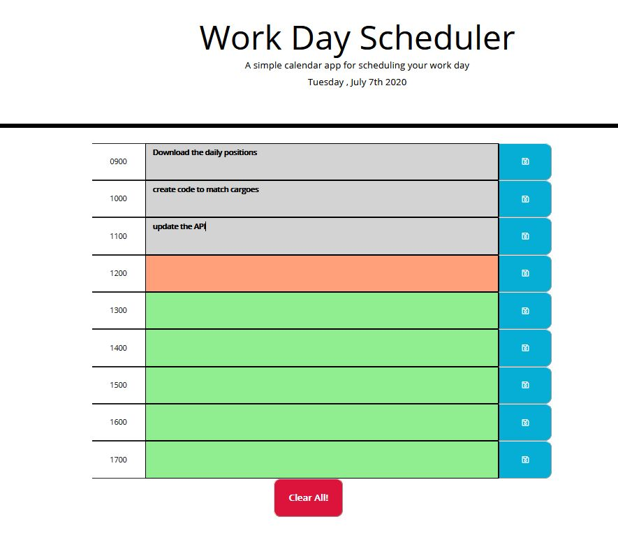

# daily-planner
Prepared a module for creating 9 rowswith 3 columns in each
attached the respective id-s and classes
styled to the specifications
created a module for populating the text areas from local storrage
created a module to saving the input fields to the local storrage
created a clear all button to clear all fields and the local storrage
added a module to check current time vs planner time and color code the fields.
{link to this portfolio](https://github.com/zhim57/daily-planner)
{link to the deployed application](https://zhim57.github.io/daily-planner)

